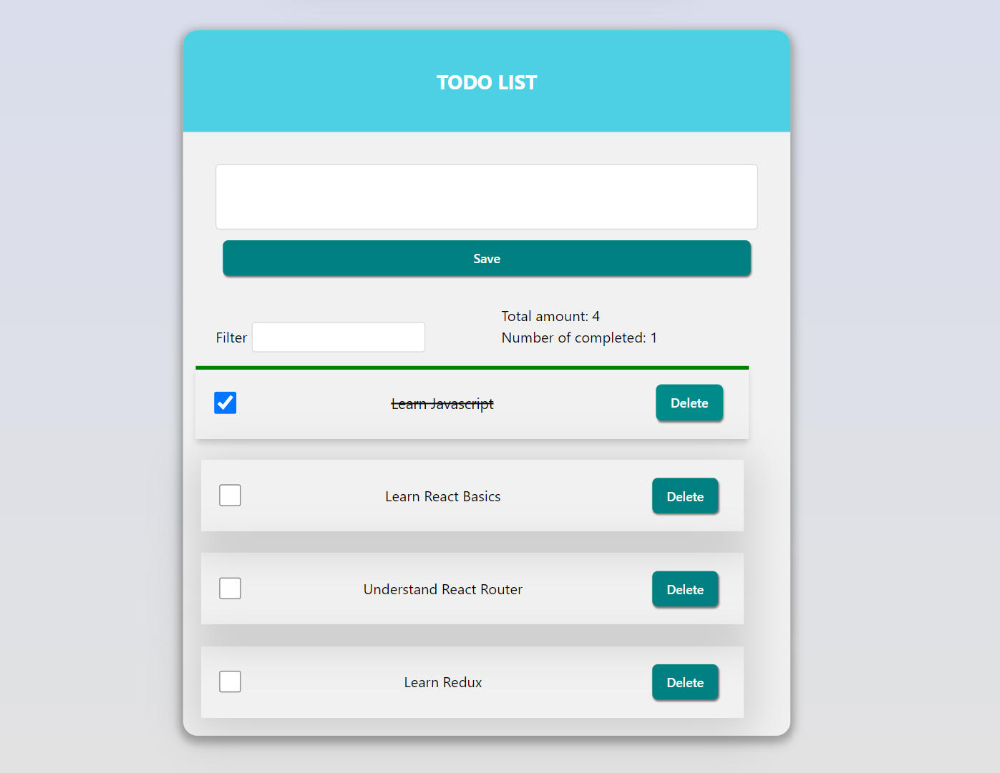

      # Todo App

The Todo App is a simple application that allows you to manage your tasks or
todos. You can add new todos, mark them as completed, delete them, and filter
the todo list based on a search query.

## Features

- Add new todos with a descriptive message.
- Mark todos as completed or uncompleted.
- Delete todos from the list.
- Filter todos based on a search query.
- View statistics on the total number of todos and completed todos.

## Technologies Used

The Todo App is built using the following technologies:

- React: A JavaScript library for building user interfaces.
- shortid: A library for generating unique IDs.
- CSS: For styling the app components.

## Getting Started

To run the Todo App locally, follow these steps:

1. Clone the repository: `git clone <repository-url>`
2. Install the dependencies: `npm install`
3. Start the development server: `npm start`
4. Open your browser and visit `http://localhost:3000` to see the app.

## Usage

- Enter your todo message in the input field and click "Save" to add a new todo.
- Click the checkbox next to a todo to mark it as completed or uncompleted.
- Click the "Delete" button to remove a todo from the list.
- Use the filter input to search for specific todos based on their text.
- View the total number of todos and the number of completed todos in the
  statistics section.

## Contributing

Contributions are welcome! If you have any suggestions, bug reports, or feature
requests, please open an issue or submit a pull request.

## License

The Todo App is open source and released under the [MIT License](LICENSE).
